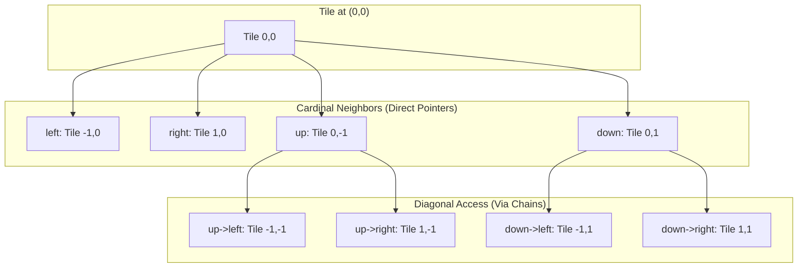
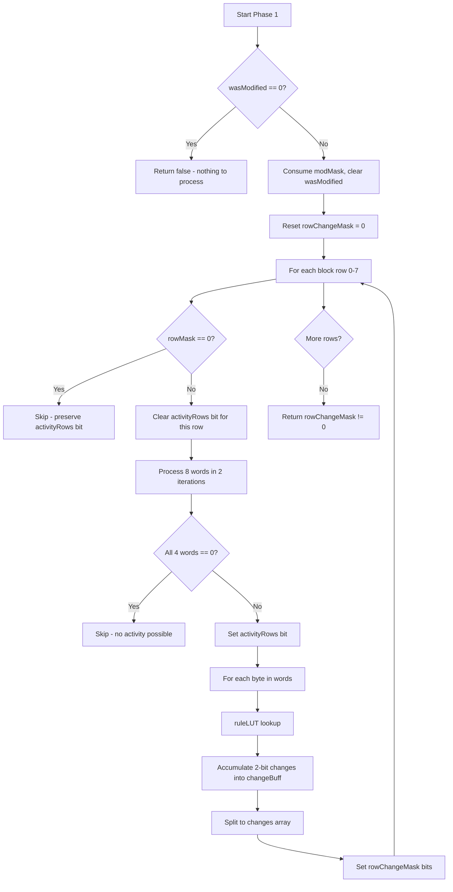
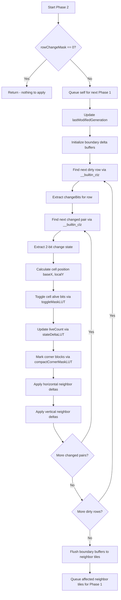
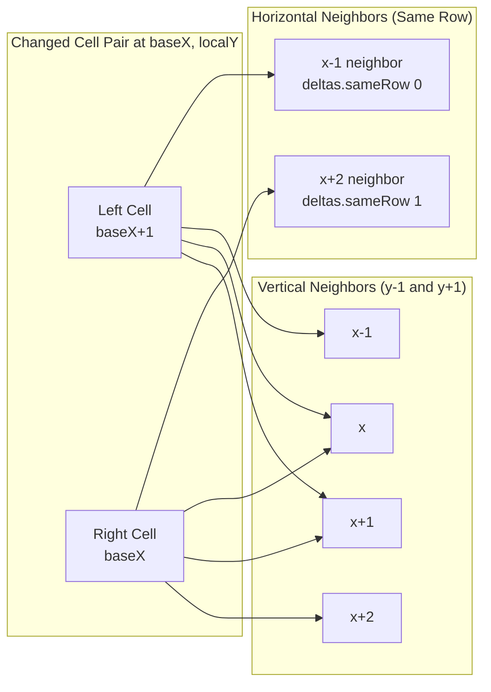
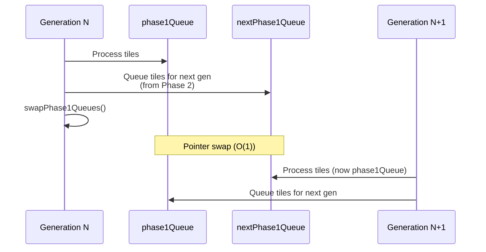
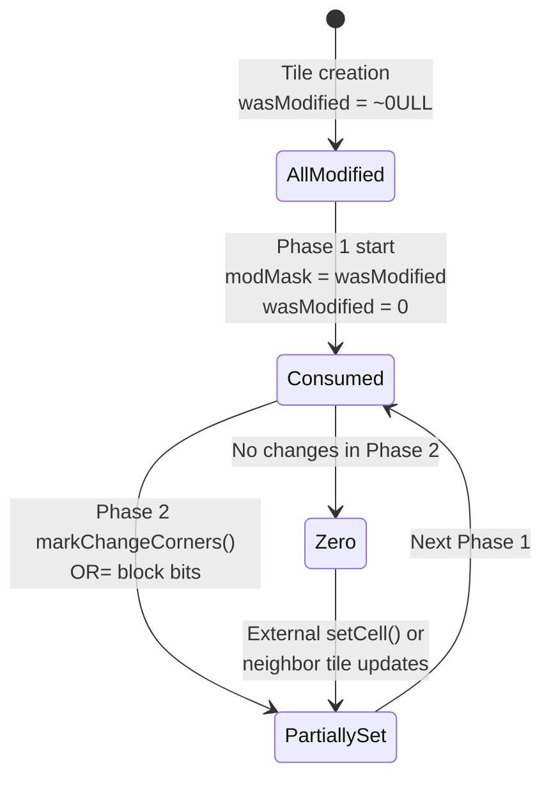
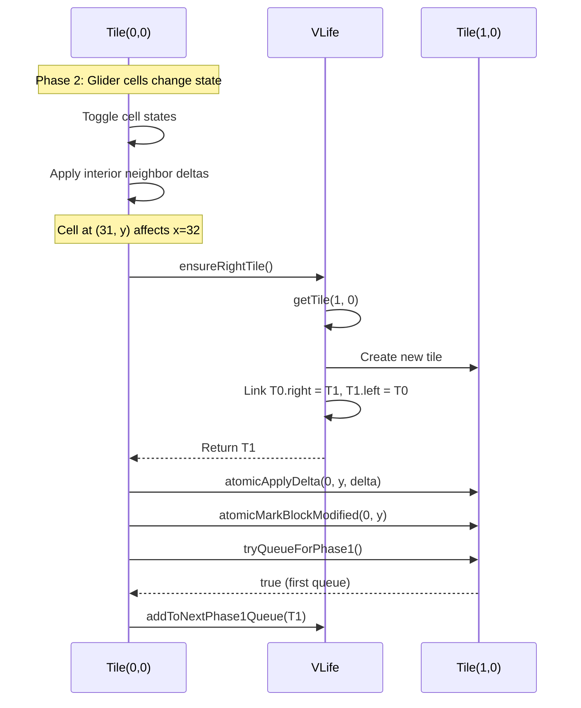
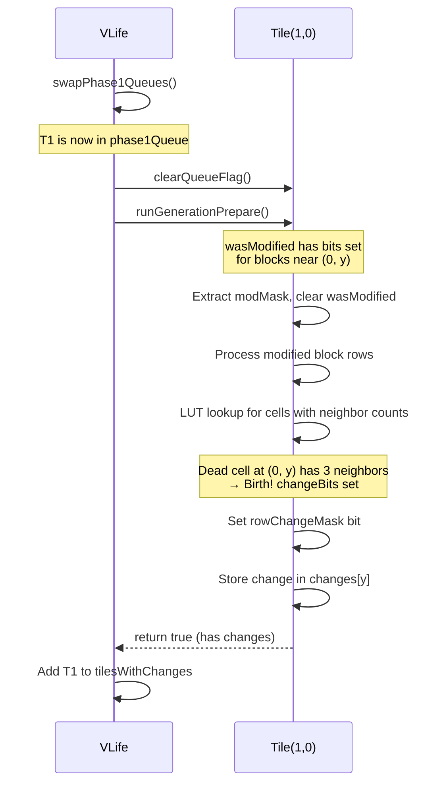
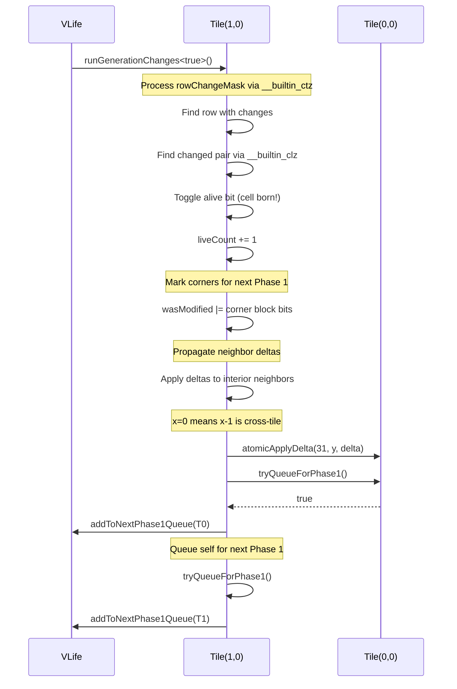

# VLife: Tile and Cell Lifecycle Technical Documentation

## Overview

This document provides a detailed technical walkthrough of the VLife cellular automaton implementation, focusing on the lifecycle of tiles and cells. VLife uses a two-phase generation processing approach with optimized queuing to achieve activity-proportional complexity.

**Key Design Principles:**
- Work is proportional to activity, not grid size
- Tiles that don't need processing won't be touched
- Cells that don't need evaluation won't be scanned
- Queuing is lock-free with minimal branching
- Cross-tile updates are batched to minimize overhead

---

## Table of Contents

1. [Data Structures](#1-data-structures)
2. [Cell Representation](#2-cell-representation)
3. [Tile Lifecycle: Creation](#3-tile-lifecycle-creation)
4. [Phase 1: Rule Evaluation](#4-phase-1-rule-evaluation-rungenerationprepare)
5. [Phase 2: State Changes and Neighbor Updates](#5-phase-2-state-changes-and-neighbor-updates-rungenerationchanges)
6. [Queuing System](#6-queuing-system)
7. [The wasModified Mechanism](#7-the-wasmodified-mechanism)
8. [Tile Eviction](#8-tile-eviction)
9. [Lookup Tables (LUTs)](#9-lookup-tables-luts)
10. [Complete Glider Scenario Walkthrough](#10-complete-glider-scenario-walkthrough)

---

## 1. Data Structures

### 1.1 Tile Memory Layout

Tiles are 64-byte aligned to prevent false sharing. Fields are organized by access frequency:

```
Cache Line 0 (Hot Path - 64 bytes):
├── wasModified:     uint64_t   [8 bytes]  - Block modification tracking
├── rowChangeMask:   uint32_t   [4 bytes]  - Dirty rows for Phase 2
├── liveCount:       uint32_t   [4 bytes]  - Live cell count
├── activityRows:    uint8_t    [1 byte]   - Activity per block row
├── lastModifiedGen: uint8_t    [1 byte]   - Eviction timestamp
├── queuedForPhase1: atomic<uint8_t> [1 byte] - Duplicate queue prevention
└── (padding)        [5 bytes]

Cache Lines 1-8 (Cell Data - 512 bytes):
└── cells[64]:       uint64_t[64]          - 1024 cells, 4 bits each

Cache Lines 9-10 (Change Tracking - 128 bytes):
└── changes[32]:     uint32_t[32]          - 2 bits per cell pair per row

Cold Metadata:
├── board:           VLife*     - Back pointer to board
├── tileX, tileY:    int32_t    - Tile coordinates
└── left, right, up, down: Tile* - Cardinal neighbor pointers
```

### 1.2 AtomicQueue

Lock-free queue optimized for multiple producers, single-pass iteration:

```cpp
template<typename T, size_t MaxSize = 65536>
struct AtomicQueue {
    std::array<T, MaxSize> data;
    std::atomic<size_t> count{0};

    void push_back(T item) {
        size_t idx = count.fetch_add(1, std::memory_order_relaxed);
        data[idx] = item;
    }

    void clear() { count.store(0, std::memory_order_relaxed); }
};
```

**Trade-offs:**
- O(1) push with no locking
- Fixed capacity (65536 tiles maximum)
- Zero merge overhead between generations

---

## 2. Cell Representation

### 2.1 Nibble Format

Each cell occupies 4 bits (one nibble):

```
Bit 3:   Alive flag (0=dead, 1=alive)
Bits 2-0: Neighbor count (0-7, excluding paired cell)
```

### 2.2 Cell Pair Layout

Two adjacent cells share one byte. A 64-bit word contains 16 cell pairs:

```
Byte: [L_alive:1][L_count:3][R_alive:1][R_count:3]
        bit 7      bits 6-4    bit 3      bits 2-0

64-bit word (16 cell pairs):
┌─────────┬─────────┬─────────┬─────────┬───┬─────────┐
│ Pair 7  │ Pair 6  │ Pair 5  │ Pair 4  │...│ Pair 0  │
└─────────┴─────────┴─────────┴─────────┴───┴─────────┘
  MSB                                            LSB
```

### 2.3 Implicit Neighbor Count

The paired cell's liveness is implicitly added to the neighbor count:

```cpp
// When evaluating rules:
trueLeftNeighbors = storedLeftNeighbors + rightAlive;
trueRightNeighbors = storedRightNeighbors + leftAlive;
```

This encoding allows 8 neighbors to be represented with only 3 bits by leveraging the paired cell's state.

---

## 3. Tile Lifecycle: Creation

### 3.1 Creation Trigger

Tiles are created on-demand when:
1. `setCell()` is called for a cell in a non-existent tile
2. Phase 2 propagates neighbor deltas to an adjacent tile that doesn't exist
3. Diagonal access traverses through a non-existent cardinal neighbor

### 3.2 Two-Phase Locking in getTile()

```cpp
Tile* VLife::getTile(int32_t tileX, int32_t tileY) {
    // Fast path: shared lock for read (multiple readers)
    {
        std::shared_lock<std::shared_mutex> readLock(tilesMutex);
        auto it = tiles.find(coord);
        if (it != tiles.end()) return it->second;
    }

    // Slow path: exclusive lock for creation
    std::unique_lock<std::shared_mutex> writeLock(tilesMutex);

    // Re-check (another thread may have created it)
    auto it = tiles.find(coord);
    if (it != tiles.end()) return it->second;

    // Create and link
    Tile* tilePtr = tilePool.allocate(tileX, tileY);
    tiles[coord] = tilePtr;

    // Bidirectional neighbor linking...
}
```

### 3.3 Neighbor Linking

Cardinal neighbors are stored directly; diagonals are accessed via chains:



**Lazy Creation Pattern:**

```cpp
inline Tile* ensureLeftTile() {
    if (!left) board->getTile(tileX - 1, tileY);
    return left;  // Now populated by getTile's bidirectional linking
}
```

---

## 4. Phase 1: Rule Evaluation (runGenerationPrepare)

### 4.1 Overview

Phase 1 determines which cells will change state by evaluating Conway's rules via a lookup table.

### 4.2 Processing Flow



### 4.3 Hierarchical Skip Optimization

The `wasModified` mask enables block-level skipping:

```
wasModified: 64 bits = 8 block rows × 8 blocks per row
Each bit covers a 4×4 cell block (16 cells)
```

```cpp
// Extract 8-bit mask for this block row
uint8_t rowMask = (modMask >> (blockRow * 8)) & 0xFF;
if (rowMask == 0) continue;  // Skip entire block row
```

### 4.4 LUT-Based Rule Evaluation

Instead of conditional logic, a 256-byte lookup table encodes all rules:

```cpp
// Index: [leftAlive:1][leftCount:3][rightAlive:1][rightCount:3]
// Output: [leftChanged:1][rightChanged:1]

for each byte in cell data:
    changeBits = ruleLUT[cellByte];  // Single memory access, no branches
```

**Conway's Rules Encoded:**
- Survival: alive AND (2 or 3 neighbors) → no change
- Death: alive AND (<2 or >3 neighbors) → changed
- Birth: dead AND (exactly 3 neighbors) → changed

### 4.5 Output

- `changes[32]`: 32-bit word per row, 2 bits per cell pair
- `rowChangeMask`: Bit N set if row N has changes
- Returns `true` if any cells changed (tile needs Phase 2)

---

## 5. Phase 2: State Changes and Neighbor Updates (runGenerationChanges)

### 5.1 Overview

Phase 2 toggles cell states and propagates neighbor count deltas to affected cells.

### 5.2 Processing Flow



### 5.3 Efficient Dirty Row Iteration

```cpp
uint32_t remainingRows = rowChangeMask;
while (remainingRows != 0) {
    int localY = __builtin_ctz(remainingRows);  // Count trailing zeros
    remainingRows &= remainingRows - 1;          // Clear lowest set bit
    // Process row localY...
}
```

**Performance:** O(popcount) iterations instead of O(32)

### 5.4 Efficient Changed Pair Iteration

```cpp
while (changeBits != 0) {
    int leadingZeros = __builtin_clz(changeBits);  // Find highest set bit
    int bitPair = leadingZeros / 2;                // Convert to pair index
    int pairChangeBits = (changeBits >> (30 - bitPair*2)) & 0x3;
    changeBits &= ~(0x3U << (30 - bitPair*2));     // Clear processed pair
    // Process this pair...
}
```

### 5.5 State Toggle and Delta Application

```cpp
// Toggle cell alive bits (precomputed XOR mask)
int toggleIdx = (pairInWord << 2) | pairChangeBits;
cells[currentCellIdx] ^= toggleMaskLUT[toggleIdx].mask;

// Update live count (precomputed delta)
int stateIdx = (pairChangeBits << 2) | aliveState;
liveCount += stateDeltaLUT[stateIdx].combinedDelta;

// Look up neighbor deltas
const PackedDeltas& deltas = deltaLUT[stateDeltaLUT[stateIdx].lutIndex];
```

### 5.6 Neighbor Delta Propagation



### 5.7 Cross-Tile Boundary Handling

Boundary deltas are buffered and applied atomically:

```cpp
// Stack-local buffers
int8_t upNeighborDeltas[TILE_WIDTH] = {0};
int8_t downNeighborDeltas[TILE_WIDTH] = {0};

// Accumulate during row processing
if (isTopRow) {
    accumulateVerticalDeltasToArrays(upNeighborDeltas, baseX, deltas.verticalRow, ...);
    hasUpDeltas = true;
}

// Flush at end
if (hasUpDeltas) {
    Tile* upTile = ensureUpTile();
    upTile->atomicAddBoundaryDeltas(TILE_HEIGHT - 1, upNeighborDeltas);
    if (upTile->tryQueueForPhase1()) {
        board->addToNextPhase1Queue(upTile);
    }
}
```

**Benefits:**
- Single atomic operation per neighbor tile row
- Single queue check per neighbor tile
- Reduced lock contention

---

## 6. Queuing System

### 6.1 Double-Buffered Phase 1 Queue



```cpp
inline void swapPhase1Queues() {
    phase1Queue->clear();
    std::swap(phase1Queue, nextPhase1Queue);  // Pointer swap, not data copy
}
```

### 6.2 Duplicate Queue Prevention

```cpp
inline bool tryQueueForPhase1() {
    uint8_t expected = 0;
    return queuedForPhase1.compare_exchange_strong(expected, 1,
        std::memory_order_relaxed, std::memory_order_relaxed);
}
```

**Invariant:** Each tile appears at most once in nextPhase1Queue per generation.

### 6.3 Queue Entry Points

Tiles get queued for Phase 1 when:

1. **User calls setCell():** Direct modification
2. **Phase 2 modifies itself:** Tile had state changes
3. **Phase 2 modifies neighbor tile:** Cross-tile delta propagation
4. **setCell() affects neighbor tile:** Initial board setup

---

## 7. The wasModified Mechanism

### 7.1 Block Indexing

```
wasModified: 64-bit mask
├── 8 block rows (y dimension)
└── 8 blocks per row (x dimension)

Block index = ((y & 0x1C) << 1) | (x >> 2)
            = (blockRow * 8) + blockCol
```

### 7.2 Lifecycle



### 7.3 markChangeCorners: Interior Fast Path

For cells not on tile boundaries (~97% of cells):

```cpp
bool isInterior = (baseX >= 2 && baseX <= 28 && localY >= 1 && localY <= 30);
if (isInterior) {
    int yClass = localY & 3;
    int blockRow = localY >> 2;
    int lutIdx = (yClass << 6) | ((baseX >> 1) << 2) | changeState;

    const CompactCornerMask& mask = compactCornerMaskLUT[lutIdx];

    int upperRow = blockRow - (yClass == 0);
    int lowerRow = blockRow + (yClass == 3);

    wasModified |= (mask.upper << (upperRow * 8)) | (mask.lower << (lowerRow * 8));
}
```

**LUT Size:** 256 entries × 2 bytes = 512 bytes (16x smaller than naive 8KB)

### 7.4 markChangeCorners: Boundary Slow Path

For cells on tile boundaries (~3%):

```cpp
// Upper-left corner example
if (topOut && leftOut) {
    if (up && up->left) {
        up->left->atomicMarkBlockModified(leftX, topY);
    }
} else if (topOut) {
    if (up) { up->atomicMarkBlockModified(leftX, topY); }
} else if (leftOut) {
    if (left) { left->atomicMarkBlockModified(leftX, topY); }
} else {
    markBlockModified(leftX, topY);
}
```

---

## 8. Tile Eviction

### 8.1 Eviction Criteria

```cpp
inline bool isSafeToEvict() const {
    return liveCount == 0 && activityRows == 0 && wasModified == 0;
}
```

All three conditions must be met:
- **liveCount == 0:** No live cells
- **activityRows == 0:** No content found during scans
- **wasModified == 0:** No pending modifications

### 8.2 Lazy Eviction

```cpp
inline void evictDeadTilesLazy() {
    if (__builtin_expect((generationNumber & 0x7F) == 0, 0)) {
        evictDeadTilesActual();
    }
}
```

Eviction runs every 128 generations:
- Uses power-of-2 interval for fast modulo (bitwise AND)
- `__builtin_expect` hints branch predictor (expected false)
- Amortizes O(n) scan cost across many generations

### 8.3 Eviction Process

```cpp
void VLife::evictDeadTilesActual() {
    for (auto it = tiles.begin(); it != tiles.end(); ) {
        Tile* tile = it->second;
        if (tile->isSafeToEvict()) {
            // Unlink from cardinal neighbors
            if (tile->left) tile->left->right = nullptr;
            if (tile->right) tile->right->left = nullptr;
            if (tile->up) tile->up->down = nullptr;
            if (tile->down) tile->down->up = nullptr;

            tilePool.deallocate(tile);
            it = tiles.erase(it);
        } else {
            ++it;
        }
    }
}
```

---

## 9. Lookup Tables (LUTs)

### 9.1 Summary Table

| LUT | Size | Index | Purpose |
|-----|------|-------|---------|
| `ruleLUT` | 256 bytes | Cell pair byte | Conway's rules → 2-bit change |
| `deltaLUT` | 96 bytes | State codes | Neighbor count deltas |
| `compactCornerMaskLUT` | 512 bytes | yClass, xPair, changeState | Block masks for corner marking |
| `toggleMaskLUT` | 256 bytes | pairInWord, changeBits | XOR masks for state toggle |
| `stateDeltaLUT` | 64 bytes | changeBits, aliveState | Combined lutIndex + delta |

### 9.2 ruleLUT: Conway's Rule Encoding

**Index format:** `[leftAlive:1][leftCount:3][rightAlive:1][rightCount:3]`

**Output:** `[leftChanged:1][rightChanged:1]`

```cpp
// Example: byte 0xAB = 0b10101011
// leftAlive=1, leftCount=2, rightAlive=1, rightCount=3
// After adding paired neighbors: left=3, right=4
// leftAlive && 3 neighbors → survives (no change)
// rightAlive && 4 neighbors → dies (changed)
// Output: 0b01 (left unchanged, right changed)
```

### 9.3 deltaLUT: Neighbor Count Deltas

**Index:** `(leftState << 2) | rightState` where state = {0=unchanged, 1=born, 2=died}

**Output:**
```cpp
struct PackedDeltas {
    int8_t sameRow[2];     // [0]=x-1, [1]=x+2 (horizontal neighbors)
    int8_t verticalRow[4]; // x-1, x, x+1, x+2 (for y±1 rows)
};
```

### 9.4 toggleMaskLUT: State Toggle Masks

**Index:** `(pairInWord << 2) | pairChangeBits`

**Output:** 64-bit XOR mask to flip the correct alive bits

```cpp
// Example: pairInWord=3, changeBits=0b11 (both change)
// Mask has bits set at positions for both cells' alive flags
cells[idx] ^= toggleMaskLUT[toggleIdx].mask;  // Single operation
```

### 9.5 stateDeltaLUT: Combined State/Delta Values

**Index:** `(pairChangeBits << 2) | (leftWasAlive << 1) | rightWasAlive`

**Output:**
```cpp
struct StateDeltaEntry {
    uint8_t lutIndex;       // Index for deltaLUT
    int8_t combinedDelta;   // liveCount adjustment
    uint8_t changeState;    // For corner mask lookup
};
```

---

## 10. Complete Glider Scenario Walkthrough

### 10.1 Initial State

A glider in an existing tile approaches the right boundary:

```
Tile (0,0):              Empty space:
... . . . . X . . .     . . . . . . . . ...
... . . . . . X . .     . . . . . . . . ...
... . . . X X X . .     . . . . . . . . ...
... . . . . . . . .     . . . . . . . . ...
              ↑
         Column 31 (boundary)
```

### 10.2 Generation N: Phase 2 Neighbor Propagation



### 10.3 Generation N+1: Phase 1 on New Tile



### 10.4 Generation N+1: Phase 2 on New Tile



### 10.5 Tile State After Birth

```
Tile(1,0) state:
├── liveCount: 1
├── wasModified: bits set for blocks around (0, y)
├── rowChangeMask: 0 (consumed)
├── activityRows: bit set for affected block row
├── queuedForPhase1: 1 (in next queue)
└── cells[]: Cell at (0, y) has alive bit set
```

### 10.6 Future Eviction (if glider moves away)

After the glider moves further into Tile(1,0) and eventually leaves:

1. All cells die → `liveCount = 0`
2. No activity detected during Phase 1 scans → `activityRows = 0`
3. No pending modifications → `wasModified = 0`
4. Every 128 generations, `evictDeadTilesActual()` runs
5. `isSafeToEvict()` returns true
6. Tile is unlinked and deallocated

---

## Appendix A: Performance Characteristics

### Work Proportionality

| Aspect | Complexity |
|--------|------------|
| Phase 1 (per tile) | O(modified blocks × bytes per block) |
| Phase 2 (per tile) | O(changed cells) |
| Total per generation | O(k) where k = state changes |
| Memory | O(active tiles) |

### Typical Activity Ratios

| Pattern | Activity Ratio (k/N) |
|---------|---------------------|
| Glider | ~15-20% |
| Acorn | ~5-10% |
| Still life (block) | 0% (not in queue) |
| Random soup | ~30-40% |

---

## Appendix B: Thread Safety Summary

| Operation | Synchronization |
|-----------|-----------------|
| Tile creation | shared_mutex (exclusive for write) |
| Phase 1 queue push | AtomicQueue (lock-free) |
| Cross-tile delta | atomicApplyDelta (CAS loop) |
| Cross-tile wasModified | atomicMarkBlockModified (__atomic_fetch_or) |
| Queue flag | compare_exchange_strong |
| Interior cell updates | No synchronization (no races) |

---

## Appendix C: Glossary

- **Activity Ratio (k/N):** Fraction of cells that change state per generation
- **Block:** 4×4 cell region (16 cells)
- **Block Row:** 8 consecutive blocks in the x-direction (one bit of wasModified per block)
- **Cardinal Neighbor:** Directly adjacent tile (left, right, up, down)
- **Cell Pair:** Two horizontally adjacent cells sharing a byte
- **Diagonal Neighbor:** Diagonally adjacent tile (accessed via cardinal chains)
- **Interior Cell:** Cell not on tile boundary (no cross-tile synchronization needed)
- **Nibble:** 4-bit cell representation
- **wasModified:** 64-bit block modification mask
- **rowChangeMask:** 32-bit dirty row mask for Phase 2 optimization
